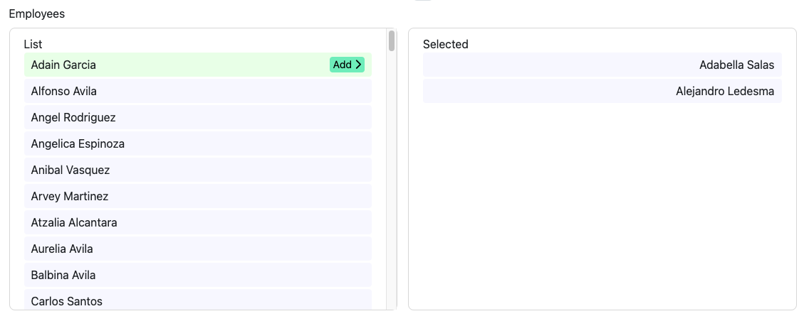

# List Picker JS

This tool enable us to create a list picker similar to List Controls in ASP.net.

## Requirements

1. Font Awesome 6
3. A browser



## Usage

First of all include the `list-picker.css` and `list-picker.js` to the html file.

### CREATE a ListPicker instance

```
window.listPicker = new ListPicker([{id:1, name: "Item 1"}, ...], "#wrapper");
```

#### Example passing the array of items from PHP

example.php
````
<?php
$items = array(
  (object)array(
    'id' => 1,
    'name' => 'John Doe',
    'another_parameter' => 'John Doe'
  ),
  (object)array(
    'id' => 2,
    'name' => 'Jane Doe',
    'another_parameter' => 'Jane Doe'
  ),
  (object)array(
    'id' => 3,
    'name' => 'Bill Gates',
    'another_parameter' => 'Bill Gates'
  ),
);

// If the array does not have the parameters required, you can create a new array with the params using a foreach and append to a new array
$items_for_list_picker = [];
foreach($items as $item){
  array_push($items_for_list_picker, (object) array('id' => $item['id'], 'name' => $item['another_parameter']));
}
?>
<html>
  <head>
    <link rel="stylesheet" type="text/css" href="path/to/list-picker.css">
    <script src="path/to/list-picker.js"></script>
  </head>
  <body>
    <div id="list-picker-wrapper"></div> <!-- By default the ListPicker will try to find the element with the id 'list-picker-wrapper' -->
    <script>
      window.listPicker = new ListPicker(<?= json_encode($items_for_list_picker) ?>); <!-- Here we are printing with php the json form of the array -->
    </script>
  </body>
</html>
````

The first parameter must be an array of objects with the items that the list will have. The ListPicker items must contain the first param `id` and the second one `name`.

### GET the selected ListPicker items

If you defined globally the ListPicker instance, you can get anytime the selected items of the list.

```
window.listPicker.selected();
```

### RESET the ListPicker instance with the items

You can reset the ListPicker instance to the initial value (with the items given, but no selected ones).

```
window.listPicker.reset();
```

